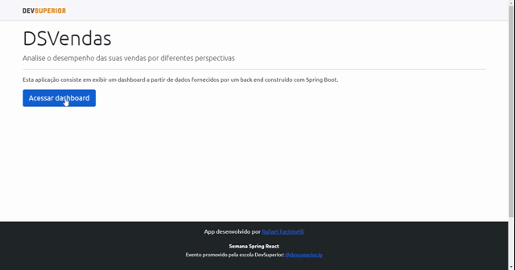

<p align="center"> 
  
  
  <a href="https://github.com/rafaelfachinelli">
    
  </a>
  
<p>

<p align="center">
 <a href="#movie_camera-demonstração">Demonstração</a> •
 <a href="#information_source-sobre">Sobre</a> •
 <a href="#memo-tarefas">Tarefas</a> •
 <a href="#dvd-executar">Executar</a> •
 <a href="#hammer-tecnologias">Tecnologias</a> •
 <a href="#boy-autor">Autor</a> •
 <a href="#page_facing_up-licença">Licença</a>
</p>

---
## :movie_camera: **Demonstração**

<p align="center">
  <b> :computer: WEB </b>
</p>

<p align="center">
  <kbd>
    
  </kbd>
</p>

---
## :information_source: Sobre

...

---
## :memo: **Tarefas**

<div align="center">
<details>
<summary>Clique para Visualizar</summary>

|Estado|Tarefa|
|:---:|:---:|
|:heavy_check_mark:|Estruturar página inicial|

</details>
</div>

---
## :dvd: **Executar**

Para executar esse projeto você precisa clonar ou [`baixar`](https://github.com/USUARIO/REPOSITORIO/archive/main.zip) este repositório, ter o Gerenciador de Pacotes do Node ([`NPM`](https://www.npmjs.com/get-npm)) ou o Gerenciador de Pacotes YARN ([`YARN`](https://yarnpkg.com/getting-started)) instalado.

### :globe_with_meridians: **WEB**

Entre na pasta [`frontend/`](frontend/) e execute os seguintes comandos:

<details>
  <summary><i>with <b>npm</b></i></summary>
  
  ```bash
  # Instalar dependências
  $ npm install

  # Iniciar servidor de desenvolvimento
  $ npm start
  ```
  
</details>

<details>
  <summary><i>with <b>npm</b></i></summary>

```bash
# Instalar dependências
$ yarn

# Iniciar servidor de desenvolvimento
$ yarn start

```

</details>

> ⚠️ O servidor de desenvolvimento iniciará na porta 3000 - Acesse <http://localhost:3000>

### :file_cabinet: **Backend**

Entre na pasta [`backend/`](backend/) e execute os seguintes comandos:


> ⚠️ O servidor iniciará na porta 8080 - Acesse <http://localhost:8080>

---
## :hammer: **Tecnologias**

As seguintes ferramentas foram utilizadas na construção do projeto:

<div align="center">

|:globe_with_meridians: Frontend|:file_cabinet: Backend|
|:---:|:---:|
|[Exemplo](https://exemplo.com)|[Exemplo](https://exemplo.com)|

</div>

---
## :boy: **Autor**

<div align="center">
  
[](https://www.linkedin.com/in/rafaelfachinelli/)

</div>

---
## :page_facing_up: **Licença**

<div align="center">
  
[](./LICENSE)

</div>
